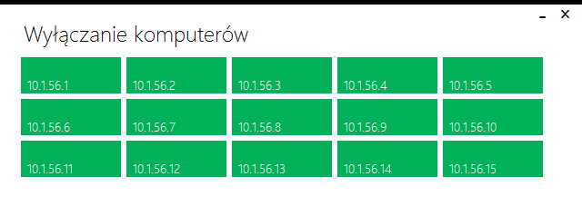

# SmartRedMotionServer
Server program for SmartRedMotion project
Uses WinForms and MetroFramework
MIT license

SmartRedMotion project uses PCB with ATMega controller and motion sensor. It shuts down all computers in an e.x. office when there's no movement for determined amount of time.

One of computers in a room is connected to the PCB via serial port and it has SmartRedMotionServer program installed.

The SmartRedMotionServer reads information sent by the PCB whether is there any movement in room or not. If there's no movement for chosen amount of time, it sends TCP packets to all previously chosen computers (using IP addresses range). Those computers that have the SmartRedMotionClient installed, will shut down.

Not connected:

Connected, movement occuring:

Connected, no movement, shutdown timer shown:

Settings menu with autostart toggle, amount of time to wait before shutting down (here: 20 mins of no movement) and range of IPs

There's an option to test whether there is good connection to all computers within given range of IPs.

Colors: green - everything OK, yellow - SmartRedMotionClient problems, black - no connections

And this window shows when the program wants to shut down all computers in the office

Made in 2014 by Arkadiusz Michalak

Microcontroller software written in C by Jakub Nadolny (not included in this repo)
